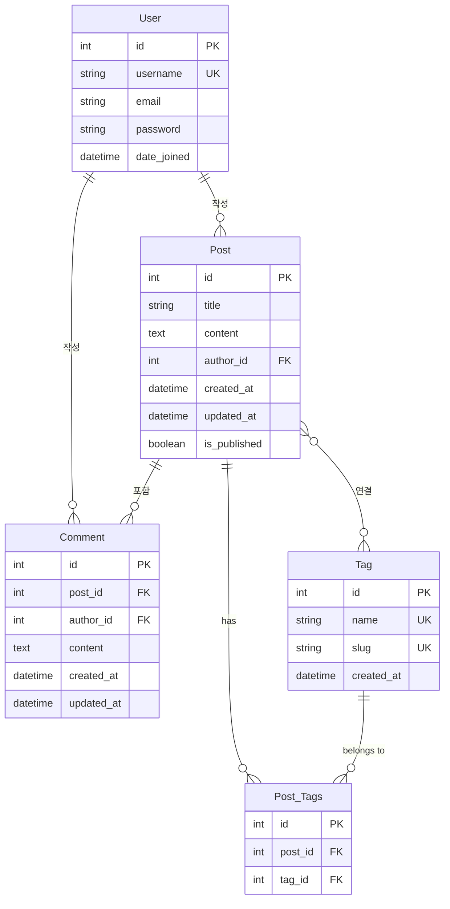

# Django 블로그 모델 설계 문서

## 목차
1. [모델 개요](#모델-개요)
2. [User 모델 (Django 기본 제공)](#user-모델)
3. [Post 모델](#post-모델)
4. [Comment 모델](#comment-모델)
5. [Tag 모델](#tag-모델)
6. [ERD (Entity Relationship Diagram)](#erd)
7. [관계 설명](#관계-설명)

---

## 모델 개요

이 블로그 애플리케이션은 총 4개의 주요 모델로 구성됩니다:
- **User**: 사용자 (Django 기본 제공)
- **Post**: 게시글
- **Comment**: 댓글
- **Tag**: 태그

---

## User 모델

Django에서 기본 제공하는 `django.contrib.auth.models.User` 모델을 사용합니다.

### 주요 필드
- `id` (PK): 자동 생성되는 Primary Key
- `username`: 사용자명 (unique)
- `email`: 이메일
- `password`: 암호화된 비밀번호
- `first_name`: 이름
- `last_name`: 성
- `is_active`: 활성화 여부
- `is_staff`: 관리자 여부
- `date_joined`: 가입일

---

## Post 모델

게시글을 저장하는 모델입니다.

### 필드 명세

| 필드명 | 타입 | 제약조건 | 설명 |
|--------|------|----------|------|
| id | AutoField | PK | 자동 생성되는 Primary Key |
| title | CharField | max_length=200 | 게시글 제목 |
| content | TextField | - | 게시글 내용 (마크다운) |
| author | ForeignKey | User, on_delete=CASCADE | 작성자 |
| created_at | DateTimeField | auto_now_add=True | 생성일시 |
| updated_at | DateTimeField | auto_now=True | 수정일시 |
| is_published | BooleanField | default=True | 공개 여부 |
| tags | ManyToManyField | Tag, blank=True | 태그 (다대다 관계) |

### 모델 코드
```python
from django.db import models
from django.contrib.auth.models import User

class Post(models.Model):
    title = models.CharField(max_length=200, verbose_name='제목')
    content = models.TextField(verbose_name='내용')
    author = models.ForeignKey(
        User,
        on_delete=models.CASCADE,
        related_name='posts',
        verbose_name='작성자'
    )
    created_at = models.DateTimeField(auto_now_add=True, verbose_name='작성일')
    updated_at = models.DateTimeField(auto_now=True, verbose_name='수정일')
    is_published = models.BooleanField(default=True, verbose_name='공개 여부')
    tags = models.ManyToManyField(
        'Tag',
        related_name='posts',
        blank=True,
        verbose_name='태그'
    )

    class Meta:
        ordering = ['-created_at']
        verbose_name = '게시글'
        verbose_name_plural = '게시글 목록'

    def __str__(self):
        return self.title

    def get_absolute_url(self):
        from django.urls import reverse
        return reverse('blog:post_detail', kwargs={'pk': self.pk})
```

---

## Comment 모델

게시글에 작성되는 댓글을 저장하는 모델입니다.

### 필드 명세

| 필드명 | 타입 | 제약조건 | 설명 |
|--------|------|----------|------|
| id | AutoField | PK | 자동 생성되는 Primary Key |
| post | ForeignKey | Post, on_delete=CASCADE | 연결된 게시글 |
| author | ForeignKey | User, on_delete=CASCADE | 작성자 |
| content | TextField | - | 댓글 내용 |
| created_at | DateTimeField | auto_now_add=True | 생성일시 |
| updated_at | DateTimeField | auto_now=True | 수정일시 |

### 모델 코드
```python
class Comment(models.Model):
    post = models.ForeignKey(
        Post,
        on_delete=models.CASCADE,
        related_name='comments',
        verbose_name='게시글'
    )
    author = models.ForeignKey(
        User,
        on_delete=models.CASCADE,
        related_name='comments',
        verbose_name='작성자'
    )
    content = models.TextField(verbose_name='댓글 내용')
    created_at = models.DateTimeField(auto_now_add=True, verbose_name='작성일')
    updated_at = models.DateTimeField(auto_now=True, verbose_name='수정일')

    class Meta:
        ordering = ['created_at']
        verbose_name = '댓글'
        verbose_name_plural = '댓글 목록'

    def __str__(self):
        return f'{self.author.username}: {self.content[:20]}'

    def get_absolute_url(self):
        return self.post.get_absolute_url()
```

---

## Tag 모델

게시글에 붙일 수 있는 태그를 저장하는 모델입니다.

### 필드 명세

| 필드명 | 타입 | 제약조건 | 설명 |
|--------|------|----------|------|
| id | AutoField | PK | 자동 생성되는 Primary Key |
| name | CharField | max_length=50, unique=True | 태그 이름 |
| slug | SlugField | max_length=50, unique=True | URL용 슬러그 |
| created_at | DateTimeField | auto_now_add=True | 생성일시 |

### 모델 코드
```python
from django.utils.text import slugify

class Tag(models.Model):
    name = models.CharField(max_length=50, unique=True, verbose_name='태그명')
    slug = models.SlugField(max_length=50, unique=True, verbose_name='슬러그')
    created_at = models.DateTimeField(auto_now_add=True, verbose_name='생성일')

    class Meta:
        ordering = ['name']
        verbose_name = '태그'
        verbose_name_plural = '태그 목록'

    def __str__(self):
        return self.name

    def save(self, *args, **kwargs):
        if not self.slug:
            self.slug = slugify(self.name, allow_unicode=True)
        super().save(*args, **kwargs)

    def get_absolute_url(self):
        from django.urls import reverse
        return reverse('blog:post_by_tag', kwargs={'slug': self.slug})
```

---

## ERD



---

## 관계 설명

### 1. User ↔ Post (1:N 관계)
- **관계**: 한 명의 사용자는 여러 게시글을 작성할 수 있습니다.
- **구현**: Post 모델에 `ForeignKey(User, on_delete=CASCADE)` 설정
- **역참조**: `user.posts.all()` - 특정 사용자가 작성한 모든 게시글 조회
- **on_delete=CASCADE**: 사용자 삭제 시 해당 사용자의 모든 게시글도 삭제됩니다.

### 2. User ↔ Comment (1:N 관계)
- **관계**: 한 명의 사용자는 여러 댓글을 작성할 수 있습니다.
- **구현**: Comment 모델에 `ForeignKey(User, on_delete=CASCADE)` 설정
- **역참조**: `user.comments.all()` - 특정 사용자가 작성한 모든 댓글 조회
- **on_delete=CASCADE**: 사용자 삭제 시 해당 사용자의 모든 댓글도 삭제됩니다.

### 3. Post ↔ Comment (1:N 관계)
- **관계**: 하나의 게시글은 여러 댓글을 가질 수 있습니다.
- **구현**: Comment 모델에 `ForeignKey(Post, on_delete=CASCADE)` 설정
- **역참조**: `post.comments.all()` - 특정 게시글의 모든 댓글 조회
- **on_delete=CASCADE**: 게시글 삭제 시 해당 게시글의 모든 댓글도 삭제됩니다.

### 4. Post ↔ Tag (N:M 관계)
- **관계**: 하나의 게시글은 여러 태그를 가질 수 있고, 하나의 태그는 여러 게시글에 연결될 수 있습니다.
- **구현**: Post 모델에 `ManyToManyField(Tag)` 설정
- **역참조**: `tag.posts.all()` - 특정 태그가 연결된 모든 게시글 조회
- **중간 테이블**: Django가 자동으로 `main_post_tags` 테이블을 생성합니다.

---

## 주요 특징

### 1. 자동 생성 필드
- `id`: 모든 모델에 자동으로 생성되는 Primary Key
- `created_at`: `auto_now_add=True`로 생성 시점 자동 저장
- `updated_at`: `auto_now=True`로 수정 시점 자동 업데이트

### 2. 관계 필드의 related_name
- `author = ForeignKey(User, related_name='posts')`: `user.posts.all()`로 접근
- `post = ForeignKey(Post, related_name='comments')`: `post.comments.all()`로 접근
- `tags = ManyToManyField(Tag, related_name='posts')`: `tag.posts.all()`로 접근

### 3. on_delete 옵션
- `CASCADE`: 참조된 객체 삭제 시 함께 삭제
- 모든 ForeignKey에 `on_delete=CASCADE` 적용

### 4. Meta 클래스
- `ordering`: 기본 정렬 순서 설정
  - Post: 최신순 (`['-created_at']`)
  - Comment: 오래된 순 (`['created_at']`)
  - Tag: 이름순 (`['name']`)
- `verbose_name`: 관리자 페이지에서 표시될 모델 이름

### 5. 메서드
- `__str__()`: 객체의 문자열 표현 (관리자 페이지 등에서 사용)
- `get_absolute_url()`: 해당 객체의 상세 페이지 URL 반환

---

## 데이터베이스 인덱스

다음 필드들에는 자동으로 인덱스가 생성됩니다:
- 모든 Primary Key (id)
- 모든 ForeignKey (author_id, post_id 등)
- unique=True 옵션이 있는 필드 (username, slug 등)

추가 성능 최적화가 필요한 경우 Meta 클래스에 `indexes` 옵션을 추가할 수 있습니다.

---

## 마이그레이션 관련 참고사항

1. 모델 생성 순서:
   - User (Django 기본 제공, 이미 존재)
   - Tag (독립적인 모델)
   - Post (User와 Tag 참조)
   - Comment (User와 Post 참조)

2. 마이그레이션 명령어:
   ```bash
   python manage.py makemigrations
   python manage.py migrate
   ```

3. 초기 데이터 생성:
   - `python manage.py createsuperuser`로 관리자 계정 생성
   - 관리자 페이지에서 Tag, Post, Comment 데이터 입력
