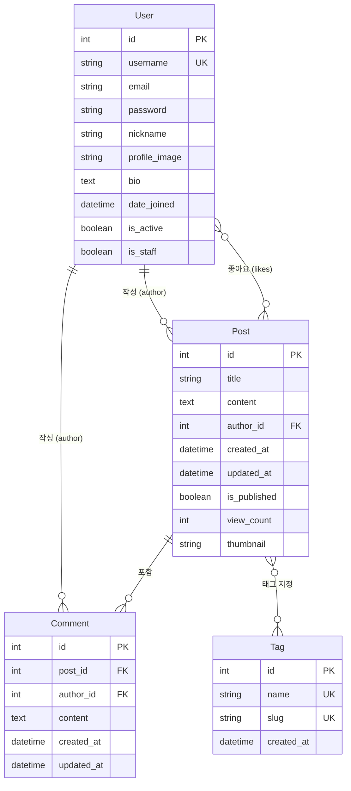

# Django 블로그 웹 애플리케이션 모델 설계

## 목차
1. [모델 개요](#모델-개요)
2. [User 모델 (확장)](#user-모델-확장)
3. [Tag 모델](#tag-모델)
4. [Post 모델](#post-모델)
5. [Comment 모델](#comment-모델)
6. [ERD (Entity Relationship Diagram)](#erd-entity-relationship-diagram)
7. [모델 필드 상세](#모델-필드-상세)

---

## 모델 개요

본 애플리케이션은 총 4개의 주요 모델로 구성됩니다:

1. **User**: Django 기본 User 모델 확장 (사용자 정보)
2. **Tag**: 블로그 글 태그 (다대다 관계)
3. **Post**: 블로그 게시글
4. **Comment**: 게시글 댓글

---

## User 모델 (확장)

Django의 기본 `AbstractUser`를 확장하여 추가 필드를 포함합니다.

### 모델명: `User`
**앱**: `accounts`

### 필드 구조
| 필드명 | 타입 | 설명 | 제약조건 |
|--------|------|------|----------|
| username | CharField | 사용자명 (기본 제공) | unique, max_length=150 |
| email | EmailField | 이메일 (기본 제공) | max_length=254 |
| password | CharField | 비밀번호 (기본 제공, 해시화) | max_length=128 |
| first_name | CharField | 이름 (기본 제공) | max_length=150, blank=True |
| last_name | CharField | 성 (기본 제공) | max_length=150, blank=True |
| **nickname** | CharField | **별명/닉네임** | **max_length=50, blank=True, null=True** |
| **profile_image** | ImageField | **프로필 이미지** | **upload_to='profile_images/', blank=True, null=True** |
| **bio** | TextField | **자기소개** | **blank=True, null=True** |
| date_joined | DateTimeField | 가입일 (기본 제공) | auto_now_add=True |
| is_active | BooleanField | 활성화 여부 (기본 제공) | default=True |
| is_staff | BooleanField | 스태프 여부 (기본 제공) | default=False |

### 관계
- **Post**: 1:N (한 사용자가 여러 게시글 작성)
- **Comment**: 1:N (한 사용자가 여러 댓글 작성)

### 메서드
- `__str__()`: username 또는 nickname 반환
- `get_display_name()`: nickname이 있으면 nickname, 없으면 username 반환

---

## Tag 모델

블로그 게시글의 태그를 관리하는 모델입니다.

### 모델명: `Tag`
**앱**: `blog` (또는 `main`)

### 필드 구조
| 필드명 | 타입 | 설명 | 제약조건 |
|--------|------|------|----------|
| name | CharField | 태그명 | max_length=50, unique=True |
| slug | SlugField | URL용 슬러그 | max_length=50, unique=True |
| created_at | DateTimeField | 생성일 | auto_now_add=True |

### 관계
- **Post**: N:M (다대다 관계 - 한 태그는 여러 게시글에, 한 게시글은 여러 태그를 가질 수 있음)

### 메서드
- `__str__()`: name 반환
- `save()`: slug가 없으면 name으로부터 자동 생성 (한글 지원)
- `get_absolute_url()`: 태그별 게시글 목록 URL 반환

### Meta
- `ordering = ['name']`: 이름 순으로 정렬
- `verbose_name = '태그'`
- `verbose_name_plural = '태그 목록'`

---

## Post 모델

블로그 게시글을 관리하는 핵심 모델입니다.

### 모델명: `Post`
**앱**: `blog` (또는 `main`)

### 필드 구조
| 필드명 | 타입 | 설명 | 제약조건 |
|--------|------|------|----------|
| title | CharField | 게시글 제목 | max_length=200 |
| content | TextField | 게시글 내용 (마크다운 지원) | - |
| author | ForeignKey | 작성자 | User 모델 참조, on_delete=CASCADE, related_name='posts' |
| created_at | DateTimeField | 작성일 | auto_now_add=True |
| updated_at | DateTimeField | 수정일 | auto_now=True |
| is_published | BooleanField | 공개 여부 | default=True |
| **view_count** | IntegerField | **조회수** | **default=0** |
| **likes** | ManyToManyField | **좋아요 (사용자 목록)** | **User 모델 참조, related_name='liked_posts', blank=True** |
| **thumbnail** | ImageField | **썸네일 이미지** | **upload_to='post_images/', blank=True, null=True** |
| tags | ManyToManyField | 태그 목록 | Tag 모델 참조, related_name='posts', blank=True |

### 관계
- **User (author)**: N:1 (여러 게시글은 한 사용자가 작성)
- **User (likes)**: N:M (여러 사용자가 여러 게시글에 좋아요)
- **Tag**: N:M (여러 게시글은 여러 태그를 가질 수 있음)
- **Comment**: 1:N (한 게시글은 여러 댓글을 가짐)

### 메서드
- `__str__()`: title 반환
- `get_absolute_url()`: 게시글 상세 페이지 URL 반환
- `increment_view_count()`: 조회수 1 증가
- `total_likes()`: 총 좋아요 수 반환

### Meta
- `ordering = ['-created_at']`: 최신 게시글부터 정렬
- `verbose_name = '게시글'`
- `verbose_name_plural = '게시글 목록'`

---

## Comment 모델

게시글의 댓글을 관리하는 모델입니다.

### 모델명: `Comment`
**앱**: `blog` (또는 `main`)

### 필드 구조
| 필드명 | 타입 | 설명 | 제약조건 |
|--------|------|------|----------|
| post | ForeignKey | 게시글 | Post 모델 참조, on_delete=CASCADE, related_name='comments' |
| author | ForeignKey | 작성자 | User 모델 참조, on_delete=CASCADE, related_name='comments' |
| content | TextField | 댓글 내용 | - |
| created_at | DateTimeField | 작성일 | auto_now_add=True |
| updated_at | DateTimeField | 수정일 | auto_now=True |

### 관계
- **Post**: N:1 (여러 댓글은 하나의 게시글에 속함)
- **User (author)**: N:1 (여러 댓글은 한 사용자가 작성)

### 메서드
- `__str__()`: "작성자: 댓글내용 일부" 형식으로 반환
- `get_absolute_url()`: 댓글이 달린 게시글 상세 페이지 URL 반환

### Meta
- `ordering = ['created_at']`: 오래된 댓글부터 정렬 (작성 순서)
- `verbose_name = '댓글'`
- `verbose_name_plural = '댓글 목록'`

---

## ERD (Entity Relationship Diagram)



---

## 모델 필드 상세

### 1. User 모델 확장 (CustomUser)

```python
# accounts/models.py
from django.contrib.auth.models import AbstractUser
from django.db import models

class User(AbstractUser):
    nickname = models.CharField(
        max_length=50,
        blank=True,
        null=True,
        verbose_name='닉네임'
    )
    profile_image = models.ImageField(
        upload_to='profile_images/',
        blank=True,
        null=True,
        verbose_name='프로필 이미지'
    )
    bio = models.TextField(
        blank=True,
        null=True,
        verbose_name='자기소개'
    )

    class Meta:
        verbose_name = '사용자'
        verbose_name_plural = '사용자 목록'

    def __str__(self):
        return self.get_display_name()

    def get_display_name(self):
        """닉네임이 있으면 닉네임, 없으면 username 반환"""
        return self.nickname if self.nickname else self.username
```

**주요 특징**:
- `AbstractUser` 상속으로 Django 기본 User 필드 모두 포함
- 별명(nickname), 프로필 이미지(profile_image), 자기소개(bio) 추가
- `get_display_name()` 메서드로 표시명 일관성 유지

**settings.py 설정 필요**:
```python
AUTH_USER_MODEL = 'accounts.User'
```

---

### 2. Tag 모델

```python
# blog/models.py (또는 main/models.py)
from django.db import models
from django.utils.text import slugify

class Tag(models.Model):
    name = models.CharField(
        max_length=50,
        unique=True,
        verbose_name='태그명'
    )
    slug = models.SlugField(
        max_length=50,
        unique=True,
        verbose_name='슬러그'
    )
    created_at = models.DateTimeField(
        auto_now_add=True,
        verbose_name='생성일'
    )

    class Meta:
        ordering = ['name']
        verbose_name = '태그'
        verbose_name_plural = '태그 목록'

    def __str__(self):
        return self.name

    def save(self, *args, **kwargs):
        if not self.slug:
            self.slug = slugify(self.name, allow_unicode=True)
        super().save(*args, **kwargs)

    def get_absolute_url(self):
        from django.urls import reverse
        return reverse('blog:post_by_tag', kwargs={'slug': self.slug})
```

**주요 특징**:
- `slug` 필드로 URL에 안전한 형태로 변환
- `allow_unicode=True`로 한글 태그 지원
- 태그 클릭 시 해당 태그의 게시글 목록으로 이동

---

### 3. Post 모델

```python
# blog/models.py (또는 main/models.py)
from django.db import models
from django.conf import settings

class Post(models.Model):
    title = models.CharField(
        max_length=200,
        verbose_name='제목'
    )
    content = models.TextField(
        verbose_name='내용'
    )
    author = models.ForeignKey(
        settings.AUTH_USER_MODEL,
        on_delete=models.CASCADE,
        related_name='posts',
        verbose_name='작성자'
    )
    created_at = models.DateTimeField(
        auto_now_add=True,
        verbose_name='작성일'
    )
    updated_at = models.DateTimeField(
        auto_now=True,
        verbose_name='수정일'
    )
    is_published = models.BooleanField(
        default=True,
        verbose_name='공개 여부'
    )
    view_count = models.IntegerField(
        default=0,
        verbose_name='조회수'
    )
    likes = models.ManyToManyField(
        settings.AUTH_USER_MODEL,
        related_name='liked_posts',
        blank=True,
        verbose_name='좋아요'
    )
    thumbnail = models.ImageField(
        upload_to='post_images/',
        blank=True,
        null=True,
        verbose_name='썸네일 이미지'
    )
    tags = models.ManyToManyField(
        'Tag',
        related_name='posts',
        blank=True,
        verbose_name='태그'
    )

    class Meta:
        ordering = ['-created_at']
        verbose_name = '게시글'
        verbose_name_plural = '게시글 목록'

    def __str__(self):
        return self.title

    def get_absolute_url(self):
        from django.urls import reverse
        return reverse('blog:post_detail', kwargs={'pk': self.pk})

    def increment_view_count(self):
        """조회수 1 증가"""
        self.view_count += 1
        self.save(update_fields=['view_count'])

    def total_likes(self):
        """총 좋아요 수 반환"""
        return self.likes.count()
```

**주요 특징**:
- 마크다운 형식의 `content` 지원 (템플릿에서 렌더링)
- `view_count`로 조회수 추적
- `likes` ManyToManyField로 좋아요 기능
- `thumbnail` 이미지 필드
- `is_published`로 공개/비공개 제어

---

### 4. Comment 모델

```python
# blog/models.py (또는 main/models.py)
from django.db import models
from django.conf import settings

class Comment(models.Model):
    post = models.ForeignKey(
        'Post',
        on_delete=models.CASCADE,
        related_name='comments',
        verbose_name='게시글'
    )
    author = models.ForeignKey(
        settings.AUTH_USER_MODEL,
        on_delete=models.CASCADE,
        related_name='comments',
        verbose_name='작성자'
    )
    content = models.TextField(
        verbose_name='댓글 내용'
    )
    created_at = models.DateTimeField(
        auto_now_add=True,
        verbose_name='작성일'
    )
    updated_at = models.DateTimeField(
        auto_now=True,
        verbose_name='수정일'
    )

    class Meta:
        ordering = ['created_at']
        verbose_name = '댓글'
        verbose_name_plural = '댓글 목록'

    def __str__(self):
        return f'{self.author.get_display_name()}: {self.content[:20]}'

    def get_absolute_url(self):
        return self.post.get_absolute_url()
```

**주요 특징**:
- `post` ForeignKey로 게시글과 연결
- `author` ForeignKey로 작성자와 연결
- 작성일 순서로 정렬 (오래된 댓글이 위로)

---

## 데이터베이스 설계 원칙

### 1. CASCADE 삭제 정책
- User 삭제 시: 해당 사용자의 모든 게시글, 댓글 삭제
- Post 삭제 시: 해당 게시글의 모든 댓글 삭제
- Tag 삭제 시: 게시글과의 관계만 삭제 (게시글은 유지)

### 2. related_name 사용
- `user.posts.all()`: 사용자가 작성한 모든 게시글
- `user.comments.all()`: 사용자가 작성한 모든 댓글
- `user.liked_posts.all()`: 사용자가 좋아요한 모든 게시글
- `post.comments.all()`: 게시글의 모든 댓글
- `tag.posts.all()`: 태그가 달린 모든 게시글

### 3. 인덱싱 고려사항
- `created_at`: 최신 게시글 조회 시 성능 향상
- `slug`: 태그 검색 시 빠른 조회
- `is_published`: 공개 게시글 필터링 시 성능 향상

---

## 마이그레이션 순서

1. **User 모델 생성** (accounts 앱)
   ```bash
   python manage.py makemigrations accounts
   python manage.py migrate accounts
   ```

2. **Tag, Post, Comment 모델 생성** (blog/main 앱)
   ```bash
   python manage.py makemigrations blog
   python manage.py migrate blog
   ```

---

## 완료!
이 모델 설계서는 좋아요, 조회수, 이미지, 사용자 별명 등을 모두 포함한 완전한 블로그 데이터베이스 구조를 정의합니다.
